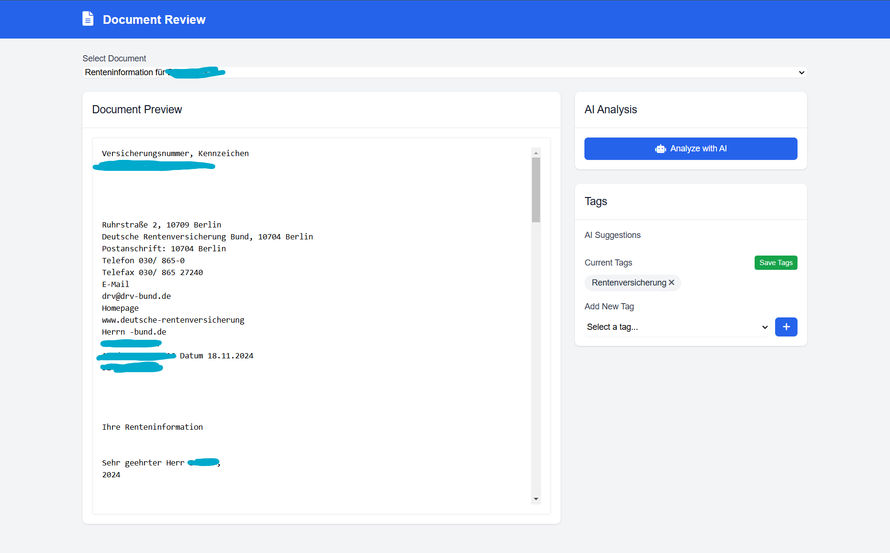

   


# Paperless-Ai

An automated document analyzer for Paperless-ngx using OpenAI API and Ollama (Mistral, llama, phi 3, gemma 2) to automatically analyze and tag your documents.

## Features

- 🔍 Automatic document scanning in Paperless-ngx

- 🤖 AI-powered document analysis using OpenAI API and Ollama (Mistral, llama, phi 3, gemma 2)
- 🏷️ Automatic title, tag and correspondent assignment
- 🔨 (NEW) Manual mode to do analysing by hand with help of AI.
- 🚀 Easy setup through web interface
- 📊 Document processing dashboard
- 🔄 Automatic restart and health monitoring
- 🛡️ Error handling and graceful shutdown
- 🐳 Docker support with health checks

## Prerequisites

- Docker and Docker Compose
- Access to a Paperless-ngx installation
- OpenAI API key or your own Ollama instance with your chosen model running and reachable.
- Basic understanding of cron syntax (for scan interval configuration)

## Installation

### You can use Docker Pull for easy setup:
```bash
docker pull clusterzx/paperless-ai
```

### Or you can do it manually by yourself:

1. Clone the repository:
```bash
git clone https://github.com/clusterzx/paperless-ai.git
cd paperless-ai
```

2. Start the container:
```bash
docker-compose up -d
```

3. Open your browser and navigate to:
```
http://localhost:3000
```

4. Complete the setup by providing:
- Paperless-ngx API URL
- Paperless-ngx API Token
- Ollama API Data
    OR
- OpenAI API Key
- Scan interval (default: every 30 minutes)

## How it Works

1. **Document Discovery**
   - Periodically scans Paperless-ngx for new documents
   - Tracks processed documents in a local SQLite database

2. **AI Analysis**
   - Sends document content to OpenAI API or Ollama for analysis
   - Extracts relevant tags and correspondent information
   - Uses GPT-4o-mini or your custom Ollama model for accurate document understanding

3. **Automatic Organization**
   - Creates new tags if they don't exist
   - Creates new correspondents if they don't exist
   - Updates documents with analyzed information
   - Marks documents as processed to avoid duplicate analysis

## NEW! Manual Mode
You can now manually analyze your files by hand with the help of AI in a beautiful Webinterface.
Reachable via the ```/manual``` endpoint from the webinterface.

Preview:


## Configuration Options

The application can be configured through environment variables:

| Variable | Description | Default |
|----------|-------------|---------|
| PAPERLESS_API_URL | URL to your Paperless-ngx API | - |
| PAPERLESS_API_TOKEN | API Token from Paperless-ngx | - |
| AI_PROVIDER | AI provider to use (openai or ollama) | openai |
| OPENAI_API_KEY | Your OpenAI API key (required if using openai) | - |
| OLLAMA_API_URL | URL to your Ollama instance | http://localhost:11434 |
| OLLAMA_MODEL | Ollama model to use (e.g. llama2, mistral) | llama2 |
| SCAN_INTERVAL | Cron expression for scan interval | */30 * * * * |

## Docker Support

The application comes with full Docker support:

- Automatic container restart on failure
- Health monitoring
- Volume persistence for database
- Resource management
- Graceful shutdown handling

### Docker Commands

```bash
# Start the container
docker-compose up -d

# View logs
docker-compose logs -f

# Restart container
docker-compose restart

# Stop container
docker-compose down

# Rebuild and start
docker-compose up -d --build
```

## Health Checks

The application provides a health check endpoint at `/health` that returns:

```json
# Healthy system
{
  "status": "healthy"
}

# System not configured
{
  "status": "not_configured",
  "message": "Application setup not completed"
}

# Database error
{
  "status": "database_error",
  "message": "Database check failed"
}
```

## Debug Interface

The application includes a debug interface accessible via `/debug` that helps administrators monitor and troubleshoot the system's data:

- 🔍 View all system tags
- 📄 Inspect processed documents
- 👥 Review correspondent information

### Accessing the Debug Interface

1. Navigate to:
```
http://your-instance:3000/debug
```

2. The interface provides:
   - Interactive dropdown to select data category
   - Tree view visualization of JSON responses
   - Color-coded data representation
   - Collapsible/expandable data nodes

### Available Debug Endpoints

| Endpoint | Description |
|----------|-------------|
| /debug/tags | Lists all tags in the system |
| /debug/documents | Shows processed document information |
| /debug/correspondents | Displays correspondent data |

### Health Check Integration

The debug interface also integrates with the health check system, showing a configuration warning if the system is not properly set up.

## Development

To run the application locally without Docker:

1. Install dependencies:
```bash
npm install
```

2. Start the development server:
```bash
npm run test
```

## Contributing

1. Fork the repository
2. Create your feature branch (`git checkout -b feature/AmazingFeature`)
3. Commit your changes (`git commit -m 'Add some AmazingFeature'`)
4. Push to the branch (`git push origin feature/AmazingFeature`)
5. Open a Pull Request

## Security Considerations

- Store API keys securely
- Restrict container access
- Monitor API usage
- Regularly update dependencies
- Back up your database

## License

This project is licensed under the MIT License - see the [LICENSE](LICENSE) file for details.

## Acknowledgments

- [Paperless-ngx](https://github.com/paperless-ngx/paperless-ngx) for the amazing document management system
- OpenAI API
- The Express.js and Node.js communities for their excellent tools

## Support

If you encounter any issues or have questions:

1. Check the [Issues](https://github.com/clusterzx/paperless-ai/issues) section
2. Create a new issue if yours isn't already listed
3. Provide detailed information about your setup and the problem

## Roadmap

- [x] Support for custom AI models
- [x] Support for multiple language analysis
- [x] Advanced tag matching algorithms
- [ ] Custom rules for document processing
- [ ] Enhanced web interface with statistics

